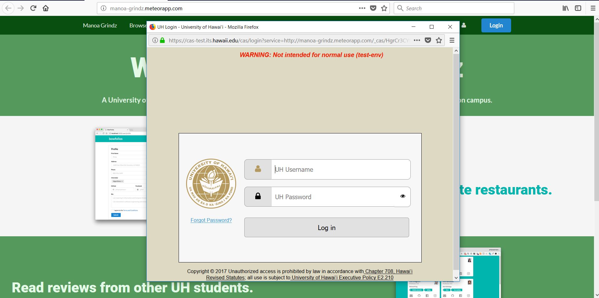
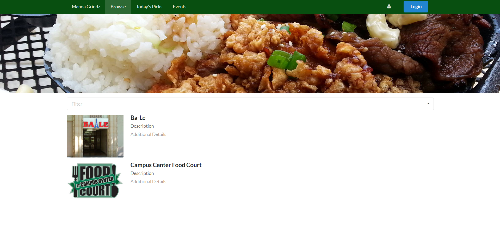
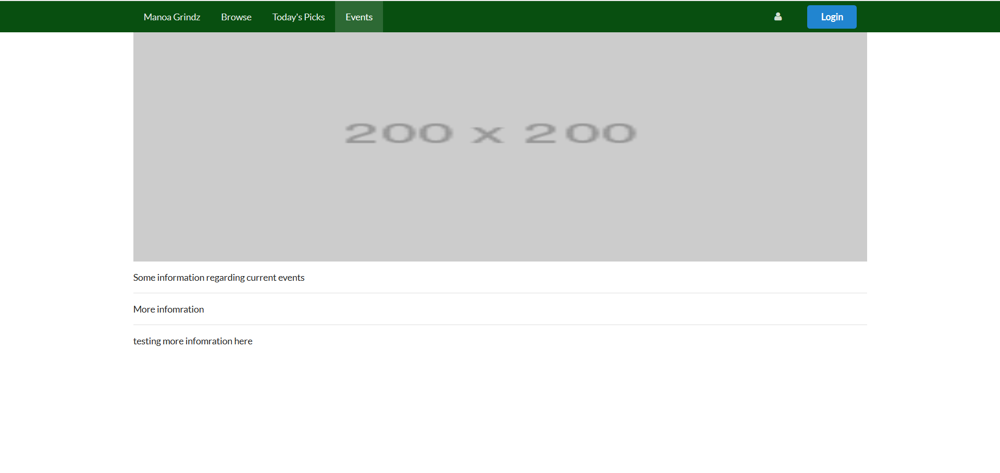

# Table of contents

* [About Manoa Grindz](#about-manoa-grindz)
* [Project Goals](#project-goals)
* [User Guide](#user-guide)
* [Community Feedback](#community-feedback)
* [Developer Guide](#developer-guide)
  * [Installation](#installation)
  * [Application design](#application-design)
    * [Directory structure](#directory-structure)
    * [Import conventions](#import-conventions)
    * [Naming conventions](#naming-conventions)
    * [Data model](#data-model)
    * [CSS](#css)
    * [Routing](#routing)
    * [Authentication](#authentication)
    * [Authorization](#authorization)
    * [Configuration](#configuration)
    * [Quality Assurance](#quality-assurance)
      * [ESLint](#eslint)
      * [Data model unit tests](#data-model-unit-tests)
      * [JSDoc](#JSDoc)

# About Manoa Grindz

* [Github Organization](https://github.com/manoa-grindz)

* [Galaxy Deployment of App](http://manoa-grindz.meteorapp.com/)

Manoa Grindz is a Meteor application that allows students to find food around the UH Manoa campus. Whether it be food trucks, vending machines, or the many other food locations on campus, Manoa Grindz is your one stop app to find food that caters to your specific tastes. 


# Project Goals

* [Milestone 1 Project Page](https://github.com/manoa-grindz/manoa-grindz/projects/1)

* [Milestone 2 Project Page](https://github.com/manoa-grindz/manoa-grindz/projects/2)

With the Monoa Grindz app, we hope to provide UH students with a way to easily find good food to eat around campus. Our goals are to provide students with a way to find food currently available around campus, search for different types of food based on personal preferences, and receive alerts when a particular food style is currently available. 

When completed, the Manoa Grindz app will eventually provide menus of all food locations on campus as well as ways to search and sort through these menus based on food types (ethnicity, vegan, etc). We also expect to add various features that allow for users to rate food and view top rated food around campus. 


# User Guide
When you first come to the Manoa Grindz website, you will be greeted by the following landing page: 
<br />


<br />
<br />
The landing page will provide you with a general introduction on what Manoa Grindz is all about. Anyone with a UH account can login to Manoa Grindz by clicking on the login button. The UH CAS authentication screen then appears and requests your UH account and password:


<br />
<br />
Once authenticated, you will be taken to the Browse page, where you can search through a list of supported UH Manoa food locations and filter out locations based on your food preferences. You can also click on the the different food locations to view more information about that particular place or learn more about the food selections they offer:
<br />
<br />
 

<br />
<br />
Manoa Grindz allows you to create your own profile once you are logged in with your UH account. By clicking the icon to the left of the logout button, you can create a profile by entering your name and selecting your different food preferences from the drop-down menu. You can also add a picture to your profile or even write a short bio about yourself:  
<br />
<br />

<br />
<br />
Manoa Grindz also provides a Today's Picks page, where you can view a selection of the top current food choices for the day: 
<br />
<br />

<br />
<br />
If you visit the Events page using the navigation bar on the top of your screen, you will be able to view a list of current and upcoming UH Manao food events. You can search through the list and click on the different food events to learn more about it:
<br />
<br />

<br />
<br />
Manoa Grindz also offers a way for you to submit restaurants that you want to see on the site. By going to the Add Restaurant page, you can fill out a form that includes information about your food location on campus. Your submitted form will then be reviewed and submitted to our database of restaurants:
<br />
<br />


# Community Feedback

Part way through the development of our application, we requested the help of five members of the community to test out the Meteor Grindz website and offer their thoughts and opinions on the current development and direction of our Meteor application. We received feedback from Rachel, Joseph, Marie, Elise, and Charles. Their feedback was compiled and placed into a pro's and con's list:

### Pro's
- Easy to understand layout. Not too complicated
- Professional looking
- Great idea for an app. People would definitely use it. 
- Color scheme is nice

### Con's
- Not enough restaurant selection
- Landing page is ugly
- Events page needs more work done to it. 
- Website looks too blank. Too much white space. 
- Profile page is pointless. There doesn't seem to be a need for it. 
- Not enough food selections. 


# Developer Guide
<br />
The following developer guide will guide a user through the process of downloading, installing, running, and modifying the system.

## Installation

First, [install Meteor](https://www.meteor.com/install).

Second, [download a copy of Manoa Grindz](https://github.com/manoa-grindz/manoa-grindz/archive/master.zip), or clone it using git.
  
Third, cd into the app/ directory and install libraries with:

```
$ meteor npm install
```

Fourth, run the system with:

```
$ meteor npm run start
```

If all goes well, the application will appear at [http://localhost:3000](http://localhost:3000). If you have an account on the UH test CAS server, you can login.  

## Application Design

### Directory structure

The top-level directory structure contains:

```
app/        # holds the Meteor application sources
config/     # holds configuration files, such as settings.development.json
.gitignore  # don't commit IntelliJ project files, node_modules, and settings.production.json
```

This structure separates configuration files (such as the settings files) in the config/ directory from the actual Meteor application in the app/ directory.

The app/ directory has this top-level structure:

```
client/
  lib/           # holds Semantic UI files.
  head.html      # the <head>
  main.js        # import all the client-side html and js files. 

imports/
  api/           # Define collection processing code (client + server side)
    base/
    interest/
    profile/
  startup/       # Define code to run when system starts up (client-only, server-only)
    client/        
    server/        
  ui/
    components/  # templates that appear inside a page template.
    layouts/     # Layouts contain common elements to all pages (i.e. menubar and footer)
    pages/       # Pages are navigated to by FlowRouter routes.
    stylesheets/ # CSS customizations, if any.

node_modules/    # managed by Meteor

private/
  database/      # holds the JSON file used to initialize the database on startup.

public/          
  images/        # holds static images for landing page and predefined sample users.
  
server/
   main.js       # import all the server-side js files.
```

### Import conventions

This system adheres to the Meteor 1.4 guideline of putting all application code in the imports/ directory, and using client/main.js and server/main.js to import the code appropriate for the client and server in an appropriate order.

This system accomplishes client and server-side importing in a different manner than most Meteor sample applications. In this system, every imports/ subdirectory containing any Javascript or HTML files has a top-level index.js file that is responsible for importing all files in its associated directory.   

Then, client/main.js and server/main.js are responsible for importing all the directories containing code they need. For example, here is the contents of client/main.js:

```
import '/imports/startup/client';
import '/imports/ui/components/form-controls';
import '/imports/ui/components/directory';
import '/imports/ui/components/user';
import '/imports/ui/components/landing';
import '/imports/ui/layouts/directory';
import '/imports/ui/layouts/landing';
import '/imports/ui/layouts/shared';
import '/imports/ui/layouts/user';
import '/imports/ui/pages/directory';
import '/imports/ui/pages/filter';
import '/imports/ui/pages/landing';
import '/imports/ui/pages/user';
import '/imports/api/base';
import '/imports/api/profile';
import '/imports/api/interest';
import '/imports/ui/stylesheets/style.css';
```

Apart from the last line that imports style.css directly, the other lines all invoke the index.js file in the specified directory.

We use this approach to make it more simple to understand what code is loaded and in what order, and to simplify debugging when some code or templates do not appear to be loaded.  In our approach, there are only two places to look for top-level imports: the main.js files in client/ and server/, and the index.js files in import subdirectories. 

Note that this two-level import structure ensures that all code and templates are loaded, but does not ensure that the symbols needed in a given file are accessible.  So, for example, a symbol bound to a collection still needs to be imported into any file that references it. 
 
### Naming conventions

This system adopts the following naming conventions:

  * Files and directories are named in all lowercase, with words separated by hyphens. Example: accounts-config.js
  * "Global" Javascript variables (such as collections) are capitalized. Example: Profiles.
  * Other Javascript variables are camel-case. Example: collectionList.
  * Templates representing pages are capitalized, with words separated by underscores. Example: Directory_Page. The files for this template are lower case, with hyphens rather than underscore. Example: directory-page.html, directory-page.js.
  * Routes to pages are named the same as their corresponding page. Example: Directory_Page.


### Data model

The Manoa Grindz data model is implemented by two Javascript classes: [ProfileCollection](https://github.com/manoa-grindz/manoa-grindz/blob/master/app/imports/api/profile/ProfileCollection.js) and [InterestCollection](https://github.com/manoa-grindz/manoa-grindz/blob/master/app/imports/api/interest/InterestCollection.js). Both of these classes encapsulate a MongoDB collection with the same name and export a single variable (Profiles and Interests)that provides access to that collection. 

Any part of the system that manipulates the Manoa Grindz data model imports the Profiles or Interests variable, and invokes methods of that class to get or set data.

There are many common operations on MongoDB collections. To simplify the implementation, the ProfileCollection and InterestCollection classes inherit from the [BaseCollection](https://github.com/manoa-grindz/manoa-grindz/blob/master/app/imports/api/base/BaseCollection.js) class.

The [BaseUtilities](https://github.com/manoa-grindz/manoa-grindz/blob/master/app/imports/api/base/BaseUtilities.js) file contains functions that operate across both classes. 

Both ProfileCollection and InterestCollection have Mocha unit tests in [ProfileCollection.test.js](https://github.com/manoa-grindz/manoa-grindz/blob/master/app/imports/api/profile/ProfileCollection.test.js) and [InterestCollection.test.js](https://github.com/manoa-grindz/manoa-grindz/blob/master/app/imports/api/interest/InterestCollection.test.js). See the section below on testing for more details.

### CSS

The application uses the [Semantic UI](http://semantic-ui.com/) CSS framework. To learn more about the Semantic UI theme integration with Meteor, see [Semantic-UI-Meteor](https://github.com/Semantic-Org/Semantic-UI-Meteor).

The Semantic UI theme files are located in [app/client/lib/semantic-ui](https://github.com/ics-software-engineering/meteor-application-template/tree/master/app/client/lib/semantic-ui) directory. Because they are located in the client/ directory and not the imports/ directory, they do not need to be explicitly imported to be loaded. (Meteor automatically loads all files into the client that are located in the client/ directory). 

Note that the user pages contain a menu fixed to the top of the page, and thus the body element needs to have padding attached to it.  However, the landing page does not have a menu, and thus no padding should be attached to the body element on that page. To accomplish this, the [router](https://github.com/manoa-grindz/manoa-grindz/blob/master/app/imports/startup/client/router.js) uses "triggers" to add an remove the appropriate classes from the body element when a page is visited and then left by the user. 

### Routing

For display and navigation among its four pages, the application uses [Flow Router](https://github.com/kadirahq/flow-router).

Routing is defined in [imports/startup/client/router.js](https://github.com/ics-software-engineering/meteor-application-template/blob/master/app/imports/startup/client/router.js).

Manoa Grindz defines the following routes:

  * The `/` route goes to the public landing page.
  * The `/directory` route goes to the public directory page.
  * The `/<user>/profile` route goes to the profile page associated with `<user>`, which is the UH account name.
  * The `/<user>/filter` route goes to the filter page associated with `<user>`, which is the UH account name.


### Authentication

For authentication, the application uses the University of Hawaii CAS test server, and follows the approach shown in [meteor-example-uh-cas](http://ics-software-engineering.github.io/meteor-example-uh-cas/).

When the application is run, the CAS configuration information must be present in a configuration file such as  [config/settings.development.json](https://github.com/ics-software-engineering/meteor-application-template/blob/master/config/settings.development.json). 

Anyone with a UH account can login and use BowFolio to create a portfolio.  A profile document is created for them if none already exists for that username.

### Authorization

The landing and directory pages are public; anyone can access those pages.

The profile and filter pages require authorization: you must be logged in (i.e. authenticated) through the UH test CAS server, and the authenticated username returned by CAS must match the username specified in the URL.  So, for example, only the authenticated user `johnson` can access the pages `http://localhost:3000/johnson/profile` and  `http://localhost:3000/johnson/filter`.

To prevent people from accessing pages they are not authorized to visit, template-based authorization is used following the recommendations in [Implementing Auth Logic and Permissions](https://kadira.io/academy/meteor-routing-guide/content/implementing-auth-logic-and-permissions). 

The application implements template-based authorization using an If_Authorized template, defined in [If_Authorized.html](https://github.com/manoa-grindz/manoa-grindz/blob/master/app/imports/ui/layouts/user/if-authorized.html) and [If_Authorized.js](https://github.com/manoa-grindz/manoa-grindz/blob/master/app/imports/ui/layouts/user/if-authorized.js).

### Configuration

The [config](https://github.com/manoa-grindz/manoa-grindz/tree/master/config) directory is intended to hold settings files.  The repository contains one file: [config/settings.development.json](https://github.com/manoa-grindz/manoa-grindz/blob/master/config/settings.development.json).

The [.gitignore](https://github.com/manoa-grindz/manoa-grindz/blob/master/.gitignore) file prevents a file named settings.production.json from being committed to the repository. So, if you are deploying the application, you can put settings in a file named settings.production.json and it will not be committed.

Manoa Grindz checks on startup to see if it has an empty database in [initialize-database.js](https://github.com/manoa-grindz/manoa-grindz/blob/master/app/imports/startup/server/initialize-database.js), and if so, loads the file specified in the configuration file, such as [settings.development.json](https://github.com/manoa-grindz/manoa-grindz/blob/master/config/settings.development.json).  For development purposes, a sample initialization for this database is in [initial-collection-data.json](https://github.com/manoa-grindz/manoa-grindz/blob/master/app/private/database/initial-collection-data.json).

### Quality Assurance

#### ESLint

Manoa Grindz includes a [.eslintrc](https://github.com/manoa-grindz/manoa-grindz/blob/master/app/.eslintrc) file to define the coding style adhered to in this application. You can invoke ESLint from the command line as follows:

```
meteor npm run lint
```

ESLint should run without generating any errors.  

It's significantly easier to do development with ESLint integrated directly into your IDE (such as IntelliJ).

#### Data model unit tests

To run the unit tests on the data model, invoke the script named 'test', which is defined in the package.json file:

```
meteor npm run test
```

This outputs the results to the console. Here is an example of a successful run, with timestamps removed:

```
[~/github/manoa-grindz/manoa-grindz/app]-> meteor npm run test

> manoa-grindz@ test /Users/philipjohnson/github/manoa-grindz/manoa-grindz/app
> TEST_WATCH=1 meteor test --driver-package meteortesting:mocha

[[[[[ Tests ]]]]]                             

=> Started proxy.                             
=> Started MongoDB.  
                         
(STDERR) Note: you are using a pure-JavaScript implementation of bcrypt.
(STDERR) While this implementation will work correctly, it is known to be
(STDERR) approximately three times slower than the native implementation.
(STDERR) In order to use the native implementation instead, run
(STDERR) 
(STDERR)   meteor npm install --save bcrypt
(STDERR) 
(STDERR) in the root directory of your application.

 --------------------------------
 ----- RUNNING SERVER TESTS -----
 --------------------------------
   
=> Started your app.

=> App running at: http://localhost:3000/
    InterestCollection
    ✓ #define, #isDefined, #removeIt, #dumpOne, #restoreOne (69ms)
    ✓ #findID, #findIDs  
    ProfileCollection
    ✓ #define, #isDefined, #removeIt, #dumpOne, #restoreOne (66ms)
    ✓ #define (illegal interest)
    ✓ #define (duplicate interests)

   5 passing (178ms)

Load the app in a browser to run client tests, or set the TEST_BROWSER_DRIVER environment variable. See https://github.com/DispatchMe/meteor-mocha/blob/master/README.md#run-app-tests
```


#### JSDoc

Manoa Grindz supports documentation generation with [JSDoc](http://usejsdoc.org/). The package.json file defines a script called jsdoc that runs JSDoc over the source files and outputs html to the ../../bowfolio.github.io/jsdoc directory.  When committed, the index.html file providing an overview of all the documentation generate at that point in time is available at [http://manoa-grindz.github.io/jsdocs](https://manoa-grindz.github.io/jsdocs/). 

