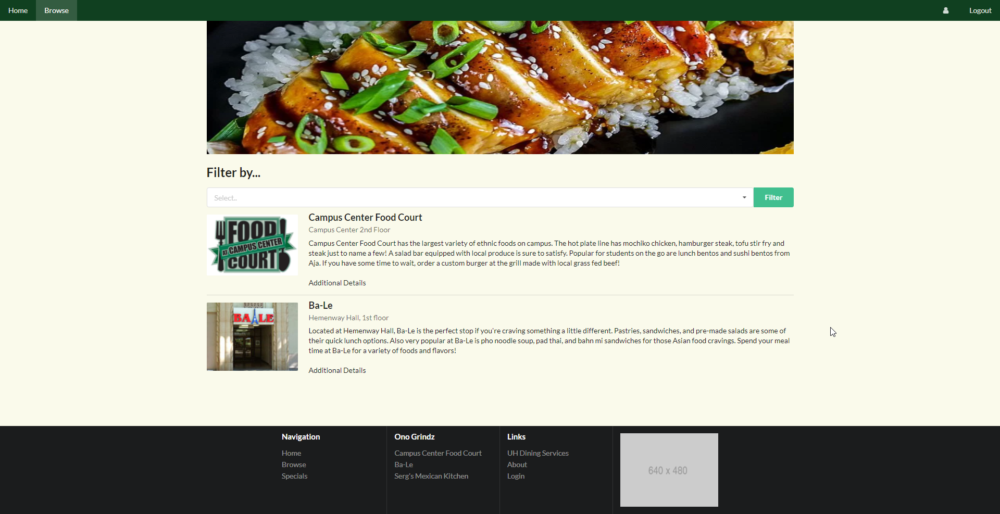

# Table of contents

* [About Manoa Grindz](#about-manoa-grindz)
* [Project Goals](#project-goals)
* [Mockup Pages](#mockup-pages)

# About Manoa Grindz

Manoa Grindz is an app that allows students to find food around the UH Manoa campus. Whether it be food trucks, vending machines, or the many other food locations on campus, Manoa Grindz is your one stop app to find food that caters to your specific tastes. 

# Project Goals

With the Monoa Grindz app, we hope to provide UH students with a way to easily find good food to eat around campus. Our goals are to provide students with a way to find food currently available around campus, search for different types of food based on personal preferences, and receive alerts when a particular food style is currently available. 

When completed, the Manoa Grindz app will eventually provide menus of all food locations on campus as well as ways to search and sort through these menus based on food types (ethnicity, vegan, etc). We also expect to add various features that allow for users to rate food and view top rated food around campus. 

# Mockup Pages

Below is our mockup directory page: 

