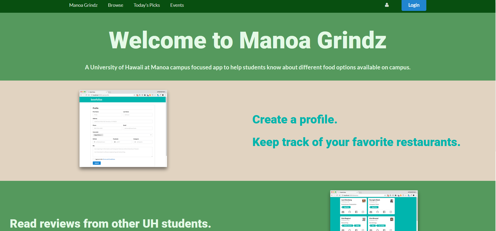

# Table of contents

* [About Manoa Grindz](#about-manoa-grindz)
* [Project Goals](#project-goals)
* [User Guide](#user-guide)
* [Community Feedback](#community-feedback)
* [Developer Guide](#developer-guide)

# About Manoa Grindz

* [Github Organization](https://github.com/manoa-grindz)

* [Galaxy Deployment of App](http://manoa-grindz.meteorapp.com/)

Manoa Grindz is a Meteor application that allows students to find food around the UH Manoa campus. Whether it be food trucks, vending machines, or the many other food locations on campus, Manoa Grindz is your one stop app to find food that caters to your specific tastes. 

# Project Goals

* [Milestone 1 Project Page](https://github.com/manoa-grindz/manoa-grindz/projects/1)

* [Milestone 2 Project Page](https://github.com/manoa-grindz/manoa-grindz/projects/2)

With the Monoa Grindz app, we hope to provide UH students with a way to easily find good food to eat around campus. Our goals are to provide students with a way to find food currently available around campus, search for different types of food based on personal preferences, and receive alerts when a particular food style is currently available. 

When completed, the Manoa Grindz app will eventually provide menus of all food locations on campus as well as ways to search and sort through these menus based on food types (ethnicity, vegan, etc). We also expect to add various features that allow for users to rate food and view top rated food around campus. 

# User Guide
When you first come to the Manoa Grindz website, you will be greeted by the following landing page: 
 

 
 
The landing page will provide you with a general introduction on what Manoa Grindz is all about. Anyone with a UH account can login to Manoa Grindz by clicking on the login button. The UH CAS authentication screen then appears and requests your UH account and password:

 
 
Once authenticated, you will be taken to the Browse page, where you can search through a list of supported UH Manoa food locations and filter out locations based on your food preferences. 
 
 
 

 
 
Manoa Grindz also provides a Today's Picks page, where you can view a selection of the top current food choices for the day. 
 
 

 
 
If you visit the Events page using the navigation bar on the top of your screen, you will be able to view a list of current and upcoming UH Manao food events. 
 
 

# Community Feedback

# Developer Guide

